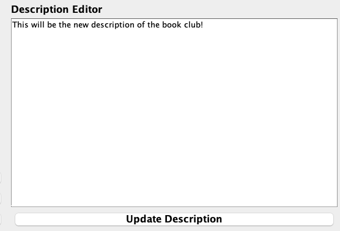

# Talk To A Club 📚🏫

**CSC207 Group 158**

**Team Name:** The Dream Team 🚀

Talk To a Club is an interactive social app designed to simplify the process of discovering, joining, and staying 
engaged with student clubs at the University of Toronto. Talk To a Club empowers students and clubs to build stronger, 
more connected communities!

This project was made for the course CSC207 - Software Design at University of Toronto St George Campus Fall 2024.

## Table of Contents
- [Contributors](#contributors)
- [Features](#features)
- [Installation Instructions](#installation-instructions)
- [Usage](#usage)
- [License](#license)
- [Feedback and Contributions](#feedback-and-contributions)

## Contributors
We are a team of passionate developers dedicated to creating a seamless social experience for students and clubs.
- Karl-Alexandre Michaud 
- Roy Liu
- Frederik Brecht
- Kabir Kumar

## Features

The app provides an all-in-one platform where **students** can:
- **Signup and Login**: Students can create an account using their personal University of Toronto email and login.
- **Browse and find clubs**: Once logged in, students can easily browse and find clubs that match their interests on the
club explore page.
- **Follow Clubs**: Students can follow clubs and stay updated through posts made by the followed clubs.
- **Leave Clubs**: Students can leave a club at any time, unsubscribing them from the announcements and posts made by that club.
- **Interact with posts**: Students can easily interact with posts by liking and disliking.
- **To be added**: A profile page to customize your student profile, a settings page, comments on posts, and recommended clubs based on user activity

Additionally, **clubs** can:
- **Signup and Login**: Prospecting clubs can create an account using the club's email and login
- **Create announcement posts**: Once logged in, clubs can create and share posts to engage with their members effectively. 
The posts will be visible to all the club members.
- **Customize the club description**: Clubs can customize their description to showcase their unique identity to 
prospecting students
- **Remove members**: Clubs are able to remove student members in case of disagreement or disruption.
- **To be added**: New types of posts such as polls and event registration posts (register for an event through the post),
a settings page and the ability to respond to comments (once the student comment feature is added).

## Installation Instructions

**Software Requirements**: A computer with IntelliJ IDEA (community or professional) installed and minimum Java8 (preferably more recent versions)

Note: If IntelliJ IDEA is not [downloaded](https://www.jetbrains.com/idea/download), please follow the following [instructions](https://www.jetbrains.com/help/idea/installation-guide.html) 
made by JetBrains.

**Instructions 🖥️**:
1) Clone the repository from GitHub. This can be done two ways.
    - Through IntelliJ IDEA by following the steps in the linked [video tutorial](https://youtu.be/pjKLtVjBh3c):
       - Navigate to the right page: Projects > Get from VCS > Repository URL
       - Enter the git repository URL in the "URL" text field:
      ```bash
         https://github.com/Karl-Michaud/csc207-final-project-club-app.git
      ```
      - Click on the "Clone" clone button

   - Through terminal by entering the following:
     ```bash
     git clone https://github.com/Karl-Michaud/csc207-final-project-club-app.git
     ```  
     
2) Open the project on the IntelliJ IDEA. (add reload the maven project)
3) Navigate to the "Main" file found in the "app" folder by following the steps in the linked [video tutorial](https://youtu.be/KgJfcL3cjAs)
   - csc207-final-project-club-app > src > main > java > app > Main.java
4) Download the Google FireBase token (ServiceAccountKey.json) and save to computer. [Download link](https://drive.google.com/file/d/18Jvt_BGyfrxYK1bGdtJyAnEidmPYn8YG/view?usp=sharing)
5) Copy the file path of the downloaded token and paste the path inside a variable in Main. Please follow the video tutorial:
   - [Windows 10/11 video tutorial](https://youtu.be/iDIZrWOe0QM)
   - [MacOS video tutorial](https://youtu.be/-d07hEs-WyQ)
6) Run the app! The [video tutorial](https://youtu.be/f4KFTGYh7zw) will also show what happens in case of an unsuccessful connection to the Google FireBase database.

## Usage

Follow these steps to use **Talk To a Club** effectively:

### 🖥️ **For Students**
1. **Sign Up or Log In**:


   - Use your University of Toronto email to create an account or log in.

2. **Explore Clubs**:


   - Navigate to the **Explore Page** to browse through available clubs.

3. **Join Clubs**:


   - From the club explore page, click on the **more info** button of the club of interest. 
   - Click the **Join Club** button on the club's profile to **join** and receive updates and announcements.

4. **Leave Clubs**:

   - From the home page or the club explore page, click on the **more info** the club you desire to leave
   - Click the **Leave Club** button on the club's profile to **leave** the club.

5. **Interact with Posts**:

   - View your followed clubs' posts on your feed.
   - Like or dislike posts to engage with content.

### 🎨 **For Clubs**
1. **Sign Up or Log In**:

 

   - Use your club's email to create an account or log in.

2. **Customize Your Profile**:

   

   - Edit your club description to attract potential members. Don't forget to save it!

3. **Create Posts**:

   

   - Navigate to the Create Post page to share announcements, events, or updates. Enter a title and description and click **Create Post** to share with members.

4. **Manage Members**:

   
   
   - View and manage your club’s members on the home page. You can click on the **Remove** button next to a student's name to remove them.

Enjoy using **Talk To a Club** to build stronger, more connected communities! 🎉

## License

MIT License

Copyright (c) 2024 Talk To a Club Team

Permission is hereby granted, free of charge, to any person obtaining a copy
of this software and associated documentation files (the "Software"), to deal
in the Software without restriction, including without limitation the rights
to use, copy, modify, merge, publish, distribute, sublicense, and/or sell
copies of the Software, and to permit persons to whom the Software is
furnished to do so, subject to the following conditions:

The above copyright notice and this permission notice shall be included in all
copies or substantial portions of the Software.

THE SOFTWARE IS PROVIDED "AS IS", WITHOUT WARRANTY OF ANY KIND, EXPRESS OR
IMPLIED, INCLUDING BUT NOT LIMITED TO THE WARRANTIES OF MERCHANTABILITY,
FITNESS FOR A PARTICULAR PURPOSE AND NONINFRINGEMENT. IN NO EVENT SHALL THE
AUTHORS OR COPYRIGHT HOLDERS BE LIABLE FOR ANY CLAIM, DAMAGES OR OTHER
LIABILITY, WHETHER IN AN ACTION OF CONTRACT, TORT OR OTHERWISE, ARISING FROM,
OUT OF OR IN CONNECTION WITH THE SOFTWARE OR THE USE OR OTHER DEALINGS IN THE
SOFTWARE.

## Feedback and Contributions

We welcome feedback and contributions to improve **Talk To a Club**! Here's how you can get involved:

### 🐛 **Reporting Bugs**
- If you encounter any issues, please report them via our [Google Form](#).
- Alternatively, you can start a discussion on our GitHub [Discussions Page](https://github.com/Karl-Michaud/csc207-final-project-club-app/discussions).

### 💡 **Feature Suggestions**
- Have an idea for a new feature? Share your thoughts on the [Discussions Page](https://github.com/Karl-Michaud/csc207-final-project-club-app/discussions).

### 🤝 **Contributing Code**
1. Fork this repository to your GitHub account.
2. Create a new branch for your changes.
3. Submit a pull request with a clear description of the updates you've made.

We appreciate all contributions, whether it's fixing bugs, improving documentation, or adding new features! 🎉


